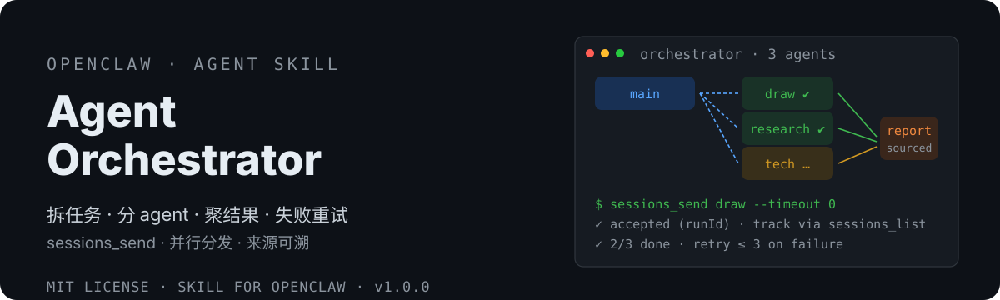

# OpenClaw Agent Orchestrator 🤝

<div align="center">
  <a href="README.md">🇨🇳 中文</a> | <strong>🌐 English</strong>
</div>

<p align="center">
  
</p>

> Multi-agent daily collaboration orchestrator — turn "split a task → dispatch to agents → track progress → aggregate results → retry failures" into a standard workflow, so your resident agents work like a team.
> 多 Agent 日常协作编排器——拆任务、分 agent、管进度、聚结果、失败重试，一条指令完成。


[](https://clawhub.ai/dtsola/skills/xiaoyaoclaw-agent-orchestrator)

## Why

You run multiple OpenClaw agents (design / research / coding...) and want them to work in parallel. Common pain points:

- ❌ **Manual channel setup**: cross-agent requires two config layers (visibility + agentToAgent), and `allow` must be **bidirectional** — full of pitfalls
- ❌ **Manual dispatch**: telling A to draw, B to research, C to summarize means sending messages one by one
- ❌ **Timeout anxiety**: sessions_send 60s timeout — is the peer still running or dead?
- ❌ **Manual aggregation**: replies scattered across sessions
- ❌ **No failure handling**: one failed agent stalls the whole flow

This skill solves it in one go: **one sentence → auto dispatch → transparent progress → sourced aggregation → auto retry (max 3)**.

## Features

- 🤝 **sessions_send only**: tasks go to the peer's **resident session** — full persona + memory + skills, like a real teammate
- 🚦 **Three-tier trigger**: explicit naming/orchestration verbs run directly; fuzzy big tasks **ask first**; everyday Q&A stays silent — never hijacks the conversation
- 🔀 **Parallel dispatch**: all subtasks fire simultaneously (fire-and-forget), total time ≈ slowest task
- 📡 **Transparent progress**: sessions_list / sessions_history for real status — **60s timeout ≠ failure** (the task keeps running in background)
- 📊 **Sourced aggregation**: report labels which conclusion came from which agent
- 🔁 **Auto retry**: default max 3 (configurable), retry carries context (skips completed parts); reports to user after 3 failures
- 📖 **Reads openclaw.json directly**: agents.list + agentToAgent.allow — one source of truth, no probing
- 🐍 **Zero-dependency scripts**: config check + status summary, pure Python stdlib, Windows / macOS

## Install

```bash
# ClawHub (recommended)
clawhub install xiaoyaoclaw-agent-orchestrator

# Or manual from GitHub
git clone https://github.com/dtsola/xiaoyaoclaw-agent-orchestrator
# Copy SKILL.md, references/, scripts/, templates/ into your skills directory
```

## Usage

### Step 1: Config auto-check (usually nothing to do)

The skill auto-detects the multi-agent config on startup:
1. Multiple agents in `agents.list`
2. `tools.agentToAgent.enabled = true`
3. `tools.sessions.visibility = "all"`
4. `tools.agentToAgent.allow` containing **BOTH sender and receiver** (bidirectional)

**If config is missing, the skill asks first**: "Want me to fix the config?" — on your OK it runs `config.patch` (minimal fields, safe merge) and you're ready to orchestrate. Prefer manual setup? See `references/agent_to_agent.md`.

Optional manual check (zero-dependency):

```bash
python scripts/check_config.py
```

`[OK]` means ready; `[FAIL]`/`[WARN]` prints fix guidance.

### Step 2: Say one sentence

**Explicit dispatch** (runs directly):
> "Ask xiaoguang to draw the product matrix, xiaozhi to research competitors, then summarize into a report"

**Fuzzy big task** (skill asks first):
> "Research this software"

The skill asks: parallel orchestration? Shows available agents and the split — runs only after you confirm.

### Step 3: Watch progress, get results

```
📋 Plan: xiaoguang→draw / xiaozhi→research / tiantong→tech
⏳ Dispatched → xiaoguang 60% → xiaozhi done → tiantong done
✅ 3/3 done → sourced report → delivered
```

### Daily habits

| Scenario | How |
|---|---|
| Named dispatch | "Ask xiaoguang to draw, xiaozhi to research, then summarize into a report" |
| Fuzzy big task | "Research XX" — the skill asks whether to orchestrate in parallel first |
| Parallel batch audit | "Ask all agents to check their own workspaces" |
| Pre-release multi-perspective review | "Have agent X review this page from a user's perspective" |
| Team daily report | "Summarize what each agent did today" |
| Failure retry | auto ≤3 retries with context, no manual intervention needed |

## FAQ

| Question | Answer |
|---|---|
| `denied by tools.agentToAgent.allow`? | `allow` must be **bidirectional** (both sender and receiver), see references/agent_to_agent.md |
| sessions_send timed out — failed? | **No.** 60s is just the wait timeout; the task continues in background. Check real status via sessions_list/history |
| Peer keeps ping-ponging? | Task prompt template embeds "reply once, don't ask"; maxPingPongTurns cap is the second safety net |
| No multi-agent config? | Cannot orchestrate (nothing to dispatch to); the skill stays silent and prompts you to configure |

## Layout

```
xiaoyaoclaw-agent-orchestrator/
├── SKILL.md                    # Skill body (three-tier trigger + 8-step flow + rules)
├── manifest.json               # compat: openclaw
├── references/
│   ├── sessions_send.md        # sessions_send deep dive (timeout semantics/announce/ping-pong)
│   ├── agent_to_agent.md       # agentToAgent config guide (visibility/bidirectional allow/pitfalls)
│   └── config_patch.md         # safe config editing (config.patch vs apply)
├── scripts/
│   ├── check_config.py         # [Highlight] check openclaw.json collaboration config → report
│   └── check_status.py         # [Highlight] parse sessions_list → subtask status summary (zero-token)
├── templates/
│   └── task_prompt.md          # dispatch prompt template ([DONE] convention + anti-ping-pong)
├── assets/readme/              # hero + community QR
├── docs/
│   └── DESIGN.md               # design doc (with competitor analysis)
├── README.md / README.en.md
└── LICENSE
```

## Orchestration Flow (8 steps)

```
① Trigger (three tiers) → ② Config check (bidirectional whitelist) → ③ Plan (subtasks + agent match + confirm)
→ ④ Parallel dispatch (sessions_send timeoutSeconds=0) → ⑤ Track (list/history judgment)
→ ⑥ Aggregate (sourced) → ⑦ Retry (≤3, with context) → ⑧ Deliver (summary + output paths)
```

## License

MIT — free to use, attribution optional.

---

## 🛠️ Customization?

**Agent & Skills customization, from ¥800.**

- WeChat: `dtsola` (note: **openclaw定制**)
- Services: OpenClaw multi-agent deployment / workspace standardization / custom Skill development / agent memory systems / multi-agent orchestration

## 💬 Join the community

Xiaoyao product family user group — feedback · exchange · suggestions:

<p align="center">
  
</p>

<p align="center">Scan to join, or add WeChat <code>dtsola</code> (note: <b>加群</b>)</p>

## Sister Projects (Seven-Piece Suite)

- 🏠 **xiaoyaoclaw-workspace-initializer**: give every agent a "home" — standard directory structure + WORKSPACE.md + multi-agent config safety.<https://github.com/dtsola/xiaoyaoclaw-workspace-initializer>
- 🧠 **xiaoyaoclaw-memory-distill**: distill conversations into MEMORY.md + daily logs.<https://github.com/dtsola/xiaoyaoclaw-memory-distill>
- 🗂️ **xiaoyaoclaw-task-progress-tracker**: directory-as-container, PROGRESS.md-as-status — tasks/ & projects/ lifecycle.<https://github.com/dtsola/xiaoyaoclaw-task-progress-tracker>
- 📚 **xiaoyaoclaw-kb-retriever**: local knowledge-base retrieval, zero-dependency, zero API key.<https://github.com/dtsola/xiaoyaoclaw-kb-retriever>
- 🩹 **xiaoyaoclaw-workspace-auditor**: read-only workspace health audit — 5 check categories + graded report.<https://github.com/dtsola/xiaoyaoclaw-workspace-auditor>
- 📎 **xiaoyaoclaw-web-clipper**: any web page → frontmatter Markdown, dual-engine extraction, knowledge-base closed loop.<https://github.com/dtsola/xiaoyaoclaw-web-clipper>
- 🤝 **xiaoyaoclaw-agent-orchestrator** (collaboration layer): on top of the six — split, dispatch, track, aggregate, retry.<https://github.com/dtsola/xiaoyaoclaw-agent-orchestrator>
